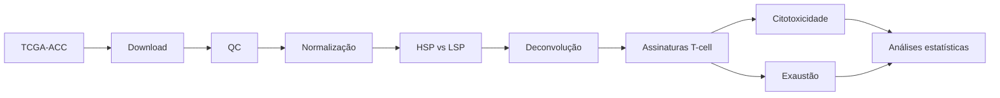

# ACC-Tcell-Differentiation-Teaching

<div align="center">

# Caracterização dos estados de diferenciação de linfócitos T no microambiente tumoral do carcinoma adrenocortical

**Material didático, scripts e documentação para o projeto de Iniciação Científica utilizando a coorte TCGA-ACC**

</div>

---

<div align="center">


</div>

---

## Visão geral

Este repositório reúne o material didático utilizado na orientação do projeto de Iniciação Científica voltado à **caracterização dos estados de diferenciação funcional de linfócitos T no microambiente tumoral do carcinoma adrenocortical (ACC)**.

O projeto investiga como os fenótipos **High Steroid Phenotype (HSP)** e **Low Steroid Phenotype (LSP)** influenciam a composição funcional do infiltrado de células T na coorte **TCGA-ACC**.

### Principais temas abordados

- Download e organização de dados do **TCGA-ACC**
- Processamento de dados de **RNA-seq bulk**
- Controle de qualidade e normalização
- Classificação **High Steroid × Low Steroid**
- Deconvolução transcriptômica do microambiente tumoral
- Inferência de estados de diferenciação de células T
- Assinaturas de citotoxicidade e exaustão imunológica
- Integração de dados clínicos e transcriptômicos
- Reprodutibilidade computacional em bioinformática

---

## Objetivos educacionais

Ao final do projeto, o estudante deverá ser capaz de:

- Utilizar o pacote **TCGAbiolinks** para acesso ao Genomic Data Commons;
- Manipular objetos **SummarizedExperiment**;
- Processar e normalizar dados de RNA-seq;
- Aplicar métodos de deconvolução transcriptômica;
- Inferir estados funcionais de linfócitos T;
- Realizar análises estatísticas e gerar visualizações em **R**;
- Documentar pipelines reprodutíveis seguindo princípios **FAIR**.

---

## Estrutura do repositório

```text
ACC-Tcell-Differentiation-Teaching/
│
├── README.md
├── aulas/
├── projeto/
├── materiais/
└── templates/
```

### `aulas/`
Scripts utilizados nas aulas práticas e na orientação.

### `projeto/`
Texto do projeto de pesquisa e documentação científica.

### `materiais/`
Artigos recomendados, referências e materiais complementares.

### `templates/`
Modelos de relatórios parcial e final.

---

## Fluxo analítico do projeto



---

## Tecnologias utilizadas

- **R**
- **Bioconductor**
- **TCGAbiolinks**
- **SummarizedExperiment**
- **DESeq2**
- **edgeR**
- **GSVA**
- **xCell**
- **MCP-counter**
- **tidyverse**

---

## Dados

⚠️ **Importante**

Os dados do TCGA **não são distribuídos neste repositório**. Cada aluno deverá realizar o download diretamente do **Genomic Data Commons (GDC)** executando os scripts fornecidos nas aulas.

---

## Referência principal do projeto

Muzzi LGS et al. *Steroidogenesis-related gene expression defines molecular phenotypes and immunological features in adrenocortical carcinoma*. **Front Endocrinol (Lausanne)**. 2021;12:672319.

---

## Orientação

**Jean Resende**  
Doutorando em Biotecnologia – Bioinformática e Imunoinformática

---

<div align="center">

**Projeto educacional voltado ao ensino de bioinformática aplicada à imunologia tumoral e transcriptômica do carcinoma adrenocortical.**

</div>
